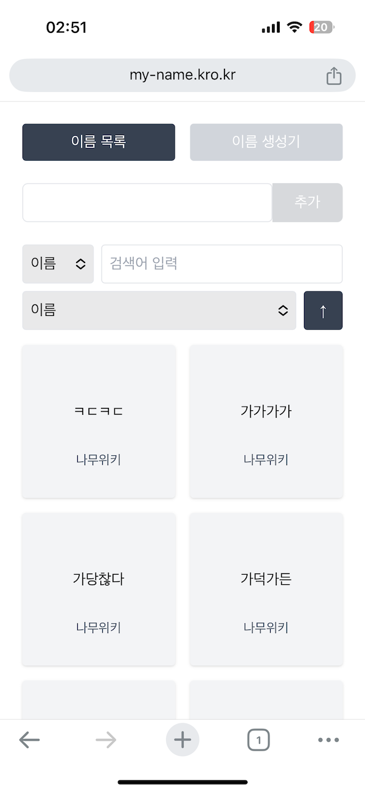

# 카더가든 이름 생성기

## 개요
- 학교 축제에 카더가든이 왔길래 마침 심심해서 만들어 봤어요..
- **"최대한 가볍게, 빠르게 만들어내자"** 라는 목표를 위해 Next.js Full-stack 개발 채택

## 사용 기술스택

|                  |                |
|------------------|----------------|
| Frontend/Backend | Next.js        |
| Database         | MongoDB(Atlas) |
| Deploy           | Vercel         |

## 페이지

| 페이지    | url                                      | 스크린샷                                                          |
|--------|------------------------------------------|---------------------------------------------------------------|
| 이름 목록  | [바로가기](https://my-name.kro.kr)           |       |
| 이름 생성기 | [바로가기](https://my-name.kro.kr/generator) |  |

## 특징

- Next.js의 서버 컴포넌트를 이용한 Full-stack 개발
- Frontend와 Backend가 단일 프로젝트에 통합되어 Vercel에 단일 배포, 이를 통해 관리 포인트, 배포 소요 축소
- App Router를 사용하여 최대한 SSR을 지향 ~~하려고 했으나 나중에는 그냥 짠듯..~~
- 이름/작성자 를 기준으로 검색, 정렬 가능한 리스트
- AI가 말아주는 카더가든 이름 생성기

## 링크
[카더가든 이름 생성기](https://my-name.kro.kr)

## 참고
[킹갓 Next Docs](https://nextjs.org/docs)

[카더가든 나무위키](https://namu.wiki/w/%EC%B9%B4%EB%8D%94%EA%B0%80%EB%93%A0)
